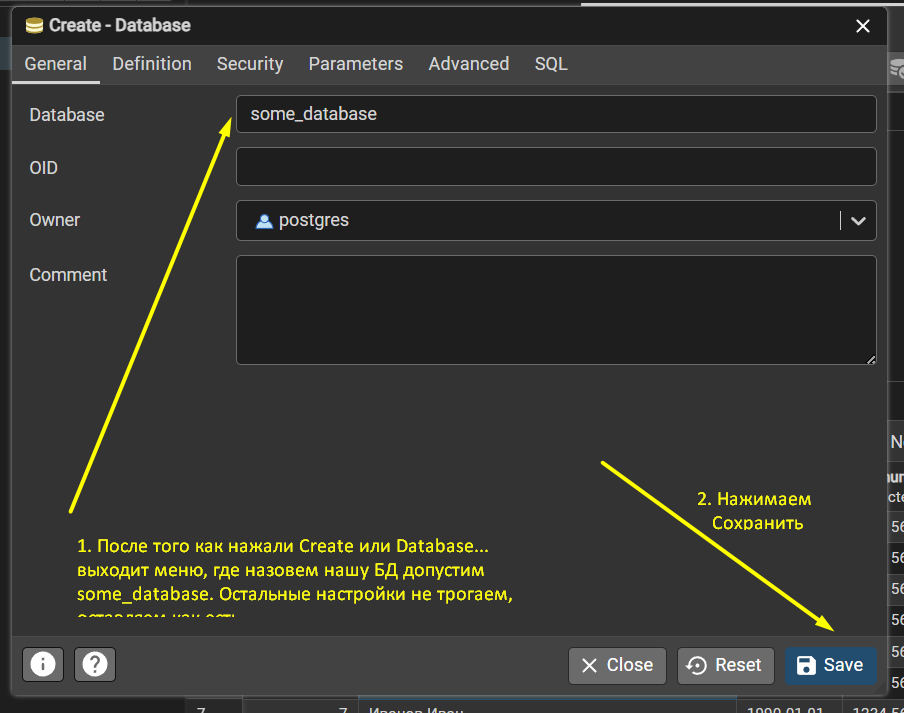
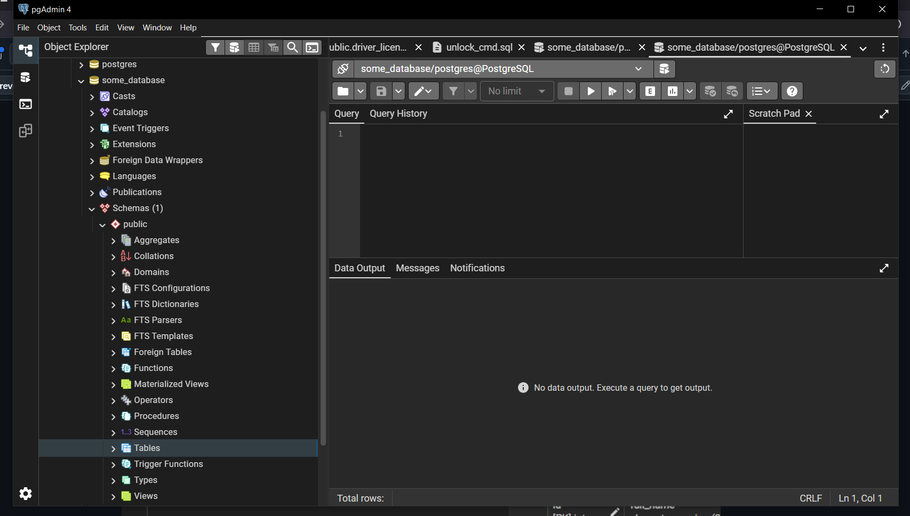
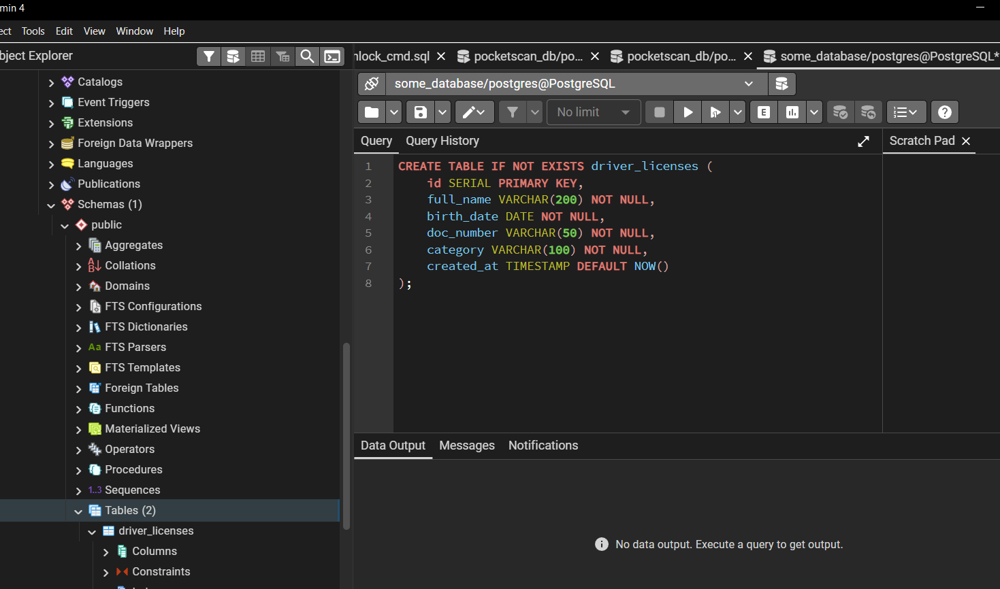

Develope SQL DB Server guide
============================

* Launch the PostgreSQL service
To do it go to the terminal and execute next command:
```net start postgresql-x64-18```

* Open the pgAdmin app

And do next instructions:






Раскрываем БД *some_database*, затем в списке находим **Schemas**, раскрываем ее также. В списке *Schemas* находим
**Tables** и нажимаем на нее правой кнопкой мыши. В появившимся меню выберем **Query Tools**.

После появится окно *Query Tools* где в ее поле можем записать наш SQL запрос.

Например как на картинке ниже:

