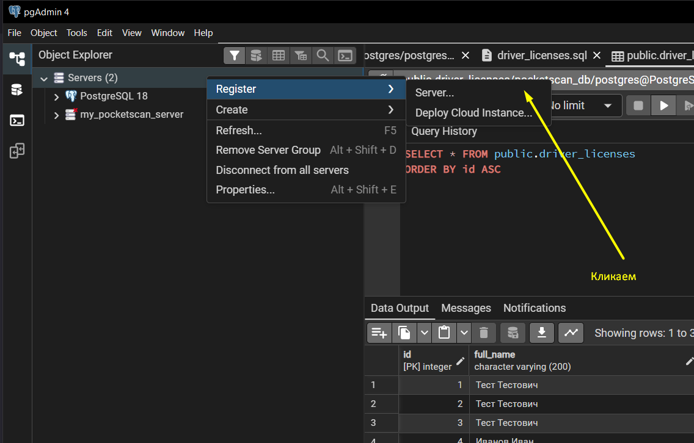
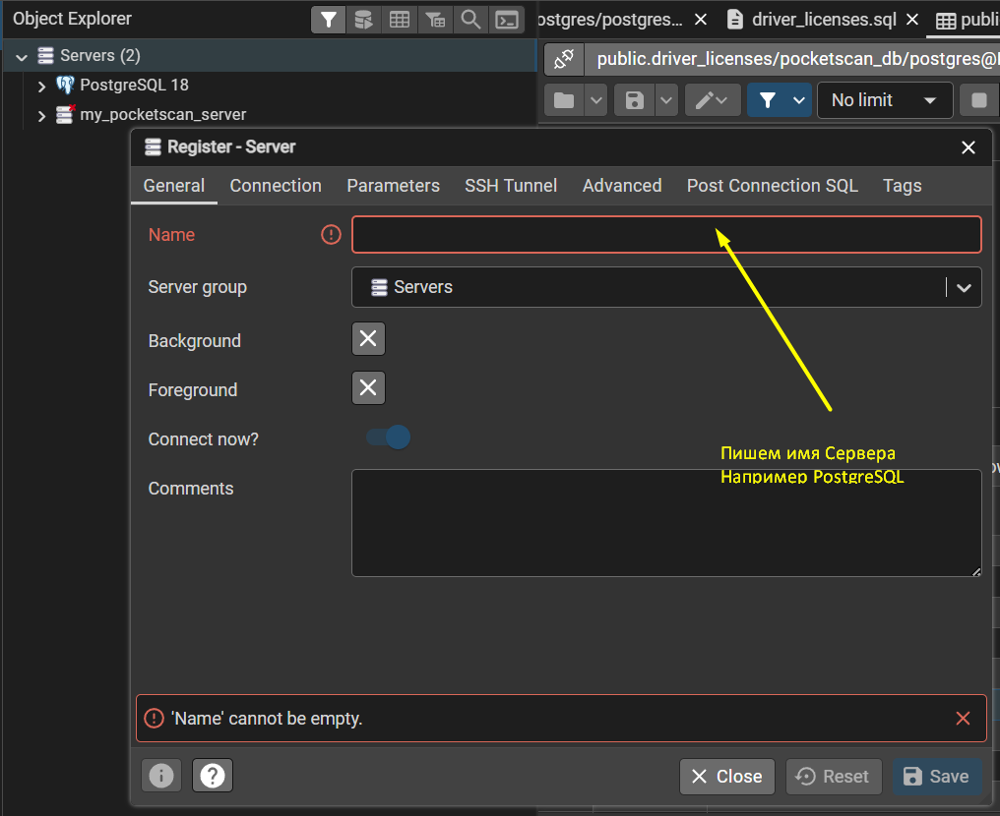
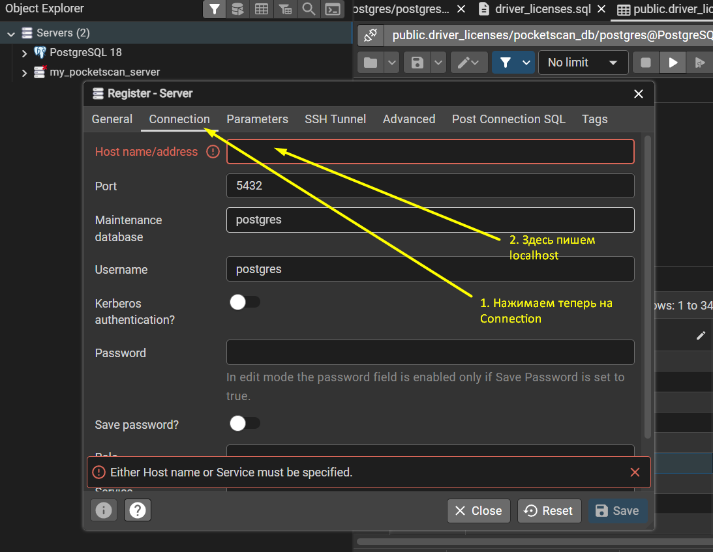
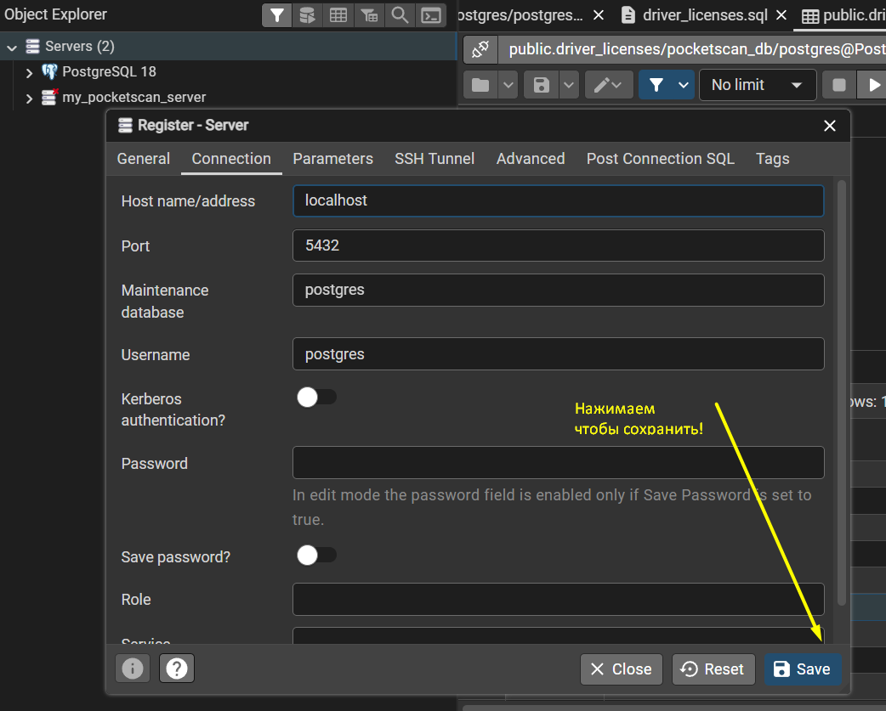
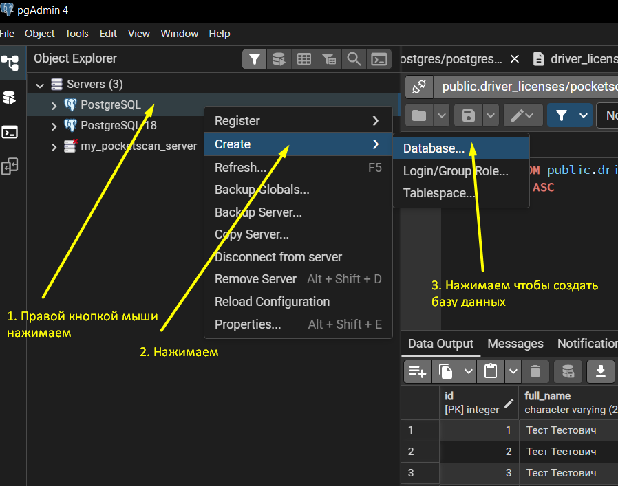

Develope SQL DB Server guide
============================

* Launch the PostgreSQL service
To do it go to the terminal and execute next command:
```net start postgresql-x64-18```

* Open the pgAdmin app

And do next instructions:









